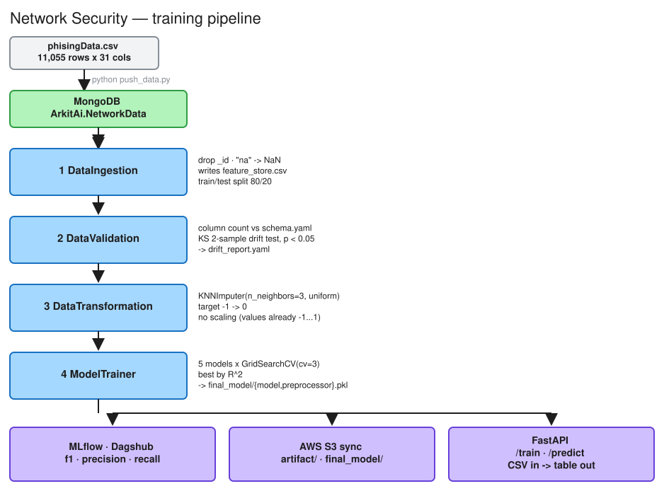

<div align="center">

# Network Security — Phishing Detection

**An end-to-end MLOps pipeline that detects phishing URLs from network traffic features.**


</div>

---

## Overview

Phishing sites can be told apart from legitimate ones by looking at the *shape* of the URL
request rather than its content — does it use an IP address in the host, how many subdomains
are there, how long is the domain registered, is the favicon present, how many outbound links
point back. This project takes 30 such integer features per request and learns a classifier
from 11,055 labelled examples.

The interesting part is not the model; it is the **pipeline discipline** around it. Data is
pulled from MongoDB, validated for schema and for train/test drift, imputed, trained with a
model bake-off, tracked in MLflow, pushed to S3, and served behind a FastAPI endpoint that
accepts a CSV and returns a prediction table. Every stage passes a typed *artifact* dataclass to
the next, so the stages stay independently runnable.

<p align="center">
  
</p>

<p align="center">
  <sub>Editable source — <a href="./pipeline.excalidraw">pipeline.excalidraw</a> · <a href="./pipeline.png">PNG fallback</a> · <a href="./pipeline.svg">SVG</a></sub>
</p>

---

## Features

| | |
| --- | --- |
| **End-to-end pipeline** | Ingestion → validation → transformation → training → serving, wired as composable stages |
| **Drift detection** | Per-column Kolmogorov–Smirnov test between train and test, reported to `drift_report.yaml` |
| **Model bake-off** | Random Forest, Decision Tree, Gradient Boosting, Logistic Regression and AdaBoost, each tuned with `GridSearchCV(cv=3)` |
| **Experiment tracking** | f1 / precision / recall logged to MLflow, remote-tracked through [Dagshub](https://dagshub.com) |
| **Artifact versioning** | Every run writes to `artifact/<MM_DD_YYYY_HH_MM_SS_>/` and syncs to S3 |
| **Structured errors** | A single `CustomException` that reports the originating file and line |
| **Web API** | FastAPI with Swagger docs, CSV-upload prediction, and an on-demand retraining route |
| **Containerised** | Dockerfile installs the AWS CLI alongside the Python deps for S3 sync |

---

## Tech stack

| Layer | Technology |
| :--- | :--- |
| Language | Python 3.10+ |
| API | FastAPI · Uvicorn · Jinja2 templates |
| Data | MongoDB (PyMongo) · Pandas · NumPy |
| ML | Scikit-learn · SciPy (`ks_2samp`) |
| Tracking | MLflow via Dagshub |
| Storage | AWS S3 (shelled out through the AWS CLI) |
| Packaging | Docker · `setup.py` |

---

## Project structure

```
NetworkSecurity/
├── .github/workflows/main.yml   # GitHub Actions (CI)
├── data_schema/schema.yaml      # 31 expected columns (30 features + Result)
├── network_data/                # phisingData.csv — the source dataset
├── networksecurity/             # the package
│   ├── components/              # data_ingestion · data_validation
│   │                            # data_transformation · model_trainer
│   ├── constants/               # paths, collection names, hyper-params
│   ├── entity/                  # config + artifact dataclasses
│   ├── pipeline/                # TrainingPipeline (batch_prediction is a stub)
│   ├── cloud/s3_syncer.py       # `aws s3 sync` wrapper
│   ├── logging/logger.py        # timestamped log files
│   ├── execption/exception.py   # CustomException  (yes, that spelling)
│   └── utils/
│       ├── main_utils/          # yaml, pickle, npy IO + evaluate_model
│       └── ml_utils/            # NetworkModel · classification metrics
├── final_model/                 # model.pkl · preprocessor.pkl
├── prediction_data/             # predicted.csv (written by /predict)
├── valid_data/                  # test.csv
├── templates/table.html         # Jinja2 template for the results table
├── mlflow.db                    # local SQLite tracking store
├── app.py                       # FastAPI entry point
├── main.py                      # local pipeline run (no S3 sync)
├── push_data.py                 # CSV → MongoDB
├── setup.py · requirements.txt · Dockerfile
```

---

## Setup

### 1. Clone and install

```bash
git clone https://github.com/Arkit003/NetworkSecurity.git
cd NetworkSecurity

python -m venv venv
source venv/bin/activate        # Windows: .\venv\Scripts\activate
pip install -r requirements.txt
```

`requirements.txt` also lists `pymongo[srv]==3.11`, which conflicts with a bare `pymongo`
entry above it — pip resolves in order, so this one matters. It's only needed for
`mongodb+srv://` Atlas URIs; drop it if you're on a local MongoDB.

### 2. Configure environment

Create a `.env` in the repo root (already git-ignored):

```env
MONGO_DB_URL="mongodb://localhost:27017"
DAGSHUB_USER_TOKEN="<your dagshub token>"

# required only if you use the S3 sync in TrainingPipeline
AWS_ACCESS_KEY_ID="..."
AWS_SECRET_ACCESS_KEY="..."
AWS_DEFAULT_REGION="us-east-1"
```

| Variable | Needed by | Required? |
| :--- | :--- | :--- |
| `MONGO_DB_URL` | ingestion, `/predict`, `/train` | Yes |
| `DAGSHUB_USER_TOKEN` | `model_trainer.py`, at **import** time | Yes, for any training run |
| `AWS_ACCESS_KEY_ID` / `AWS_SECRET_ACCESS_KEY` | `S3Sync` via the AWS CLI | Only for `TrainingPipeline` |

### 3. Load the data

```bash
python push_data.py              # CSV → MongoDB (11,055 documents)
python test_mongodb.py           # optional: verify the connection
```

---

## Usage

### Train

```bash
python main.py
```

Runs ingestion → validation → transformation → training locally, writing artifacts to
`artifact/<timestamp>/` and the deployable pair to `final_model/`. No S3 involved — use
`main.py` when you just want a local run.

### Serve

```bash
python app.py                    # http://localhost:8000
```

Then open **`http://localhost:8000/docs`** — the root route redirects there.

| Method | Route | What it does |
| :--- | :--- | :--- |
| `GET` | `/` | Redirects to `/docs` |
| `GET` | `/train` | Runs the full `TrainingPipeline`, **including both S3 syncs** |
| `POST` | `/predict` | Takes a CSV `multipart/form-data` upload, returns the frame plus a `Predicted Outcome` column as an HTML table |

`/predict` loads `final_model/model.pkl` and `final_model/preprocessor.pkl`, wraps them in
`NetworkModel`, and also writes the annotated frame to `prediction_data/predicted.csv`.

> The CSV you upload needs the same 30 feature columns as training data, minus `Result`.

### Docker

```bash
docker build -t network-security .
docker run -p 8000:8000 --env-file .env network-security
```

The image is `python:3.10-slim-buster` and installs `awscli` during the build so the S3 sync
works inside the container.

---

## The dataset

`network_data/phisingData.csv` — 11,055 rows × 31 columns (30 integer features + target).

| Label | Meaning | Count |
| :--- | :--- | ---: |
| `1` | legitimate | 6,157 |
| `-1` | phishing | 4,898 |

Features include `having_IP_Address`, `URL_Length`, `Shortining_Service`, `having_At_Symbol`,
`double_slash_redirecting`, `Prefix_Suffix`, `having_Sub_Domain`, `SSLfinal_State`,
`Domain_registeration_length`, `Favicon`, `port`, `HTTPS_token`, `Request_URL`,
`URL_of_Anchor`, `Links_in_tags`, `SFH`, `Submitting_to_email`, `Abnormal_URL`, `Redirect`,
`on_mouseover`, `RightClick`, `popUpWidnow`, `Iframe`, `age_of_domain`, `DNSRecord`,
`web_traffic`, `Page_Rank`, `Google_Index`, `Links_pointing_to_page`, `Statistical_report`.

The target is remapped `-1 → 0` during transformation, so the classifier sees `1` = legitimate
and `0` = phishing. Values are already in the range −1…1, so the pipeline deliberately skips
scaling and only imputes missing values with a 3-neighbour KNN imputer.

---

## How the best model is chosen

`evaluate_model()` runs each of the five candidates through `GridSearchCV(cv=3)`, refits with
the winning parameters, and scores it. The scores are ranked, the top model is refit on the
full training set, and f1 / precision / recall are computed for both splits and logged to
MLflow. The final bundle pickles the `NetworkModel` (estimator + preprocessor together) as the
pipeline artifact, and the bare estimator as `final_model/model.pkl` for the API to load
alongside a separately-saved preprocessor.

Tuned parameter grids:

| Model | Grid |
| :--- | :--- |
| Random Forest | `n_estimators ∈ {8, 16, 32, 128, 256}` |
| Decision Tree | `criterion ∈ {gini, entropy, log_loss}` |
| Gradient Boosting | `learning_rate ∈ {.1, .01, .05, .001}`, `subsample ∈ {.6, .7, .85, .9}`, `n_estimators ∈ {8, 16, 32, 128, 256}` |
| AdaBoost | `learning_rate ∈ {.1, .01, .001}`, `n_estimators ∈ {8, 16, 64, 128, 256}` |
| Logistic Regression | *(defaults)* |

---

## MLOps

**MLflow tracking** is initialised at the top of `model_trainer.py`:

```python
dagshub.init(repo_owner='Arkit003', repo_name='NetworkSecurity', mlflow=True)
```

which points MLflow at the remote Dagshub tracking server. A local `mlflow.db` SQLite store is
also committed from earlier runs.

**S3 sync** shells out rather than using boto3 — `S3Sync.sync_folder_to_s3()` runs
`aws s3 sync <folder> s3://arknetworksecurity/<prefix>/<timestamp>`. `TrainingPipeline` syncs
both the `artifact/` tree and `final_model/` at the end of every run; `main.py` skips it. This
means the AWS CLI must be installed and configured, and `GET /train` will fail without it.

**CI:** `.github/workflows/main.yml` runs on pushes to `main` (ignoring README-only changes) and
currently has two placeholder steps — see the caveat below.

---

## Known issues

Things worth knowing before you build on this:

- **The column-count validation is a no-op.** `validating_no_of_columns()` compares the
  dataframe width against `len(self._schema_config)`, but `schema.yaml` parses to a dict with
  two top-level keys (`columns`, `numerical_columns`), so the comparison is `31 == 2` and
  always fails. The failure is swallowed into an `error_message_train` variable that is never
  read, and the artifact's `validation_status` comes from the drift test alone. The fix is
  `len(self._schema_config["columns"])`.
- **`checking_numerical_columns()` is never called**, and its body compares an `int` to the
  schema dict, so it would return `True` unconditionally if it were.
- **Model selection scores with `r2_score`, not f1.** `evaluate_model` ranks candidates by
  R² computed on the *test* split. R² is a regression metric being used for 0/1 labels, and
  selecting on the test set leaks it into the choice. The f1/precision/recall that get logged
  to MLflow are computed afterwards and play no part in picking the winner.
- **Logs land in a directory named like a file.** `logger.py` calls
  `os.makedirs(logs_path)` where `logs_path` already includes the `.log` filename, producing
  `logs/01_12_2025_23_45_10.log/01_12_2025_23_45_10.log`. Because it runs at import time,
  merely importing anything from the package creates that directory in your CWD.
- **`DAGSHUB_USER_TOKEN` is needed just to import `model_trainer`** — `dagshub.init()` runs at
  module level, so an unset token breaks `main.py` before training starts.
- **CI is a placeholder.** The workflow's "Lint Code" and "Run unit tests" steps are just
  `echo` statements, and the repository contains no test suite — `test_mongodb.py` is a
  connection smoke check, not a test.
- **`TrainingPipelineConfig` timestamps are frozen.** `def __init__(self, timestamp=datetime.now())`
  evaluates its default once at import, so every config built in one process shares a
  timestamp and successive runs overwrite each other's artifact directory.
- **The prediction pipeline is unimplemented.** `networksecurity/pipeline/batch_prediction.py`
  is a three-line stub; prediction happens inline in the `/predict` route.
- **Repo hygiene.** `__pycache__/`, `mlflow.db` and the 27 MB `final_model/model.pkl` are all
  committed, while `.gitignore` covers only `.venv` and `.env`. The model is also uploaded to
  S3 by design, which suggests it no longer needs to live in git history.
- **`requirements.txt` pins `pymongo` twice** (bare `pymongo`, then `pymongo[srv]==3.11`) and
  pins nothing else.

---

## Contributing

Contributions are welcome — fork the repo, branch off `main`, and open a pull request. If you
touch the schema, update `data_schema/schema.yaml` and the column list in
`src`-side constants together; they're not cross-validated.

---

<div align="center">
<sub>Built with FastAPI · scikit-learn · MLflow · MongoDB · S3</sub>
</div>
